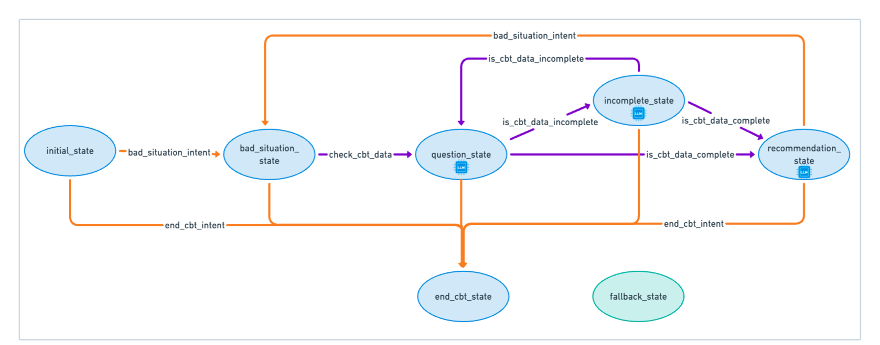
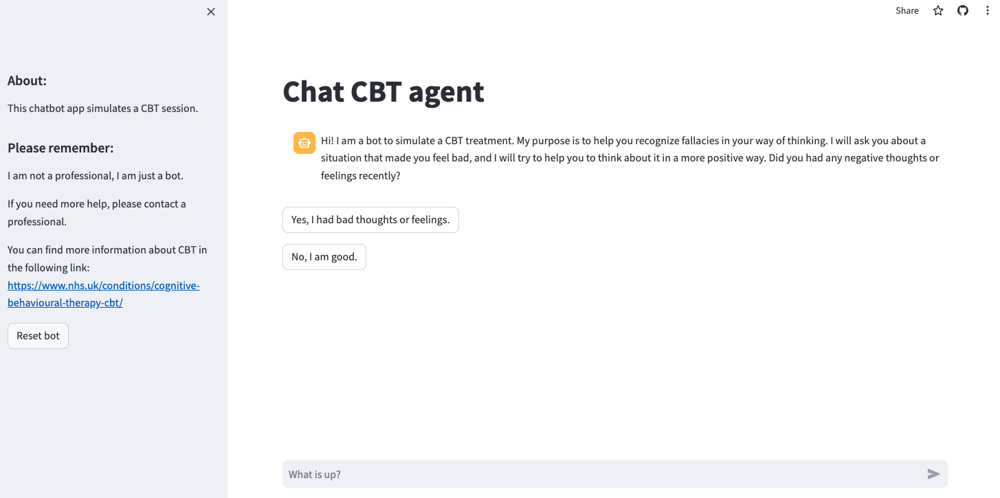
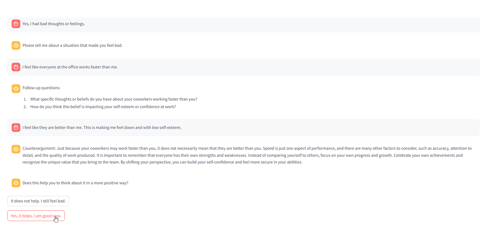

<a name="readme-top"></a>


<!-- TABLE OF CONTENTS -->
<details>
  <summary>Table of Contents</summary>
  <ol>
    <li>
      <a href="#about-the-project">About The Project</a>
      <ul>
        <li><a href="#built-with">Built With</a></li>
      </ul>
    </li>
    <li>
      <a href="#getting-started">Getting Started</a>
      <ul>
        <li><a href="#prerequisites">Prerequisites</a></li>
        <li><a href="#running">Run the project</a></li>
        <li><a href="#demo">Demo</a></li>
      </ul>
    </li>
    <li><a href="#usage">Usage</a></li>
    <li><a href="#recommendations">Recommendations</a></li>
    <li><a href="#Team">Team</a></li>
  </ol>
</details>


<!-- ABOUT THE PROJECT -->
## About The Project

Cognitive Behavioral Therapy (CBT) is a form of psychotherapy that aims to improve mental health by changing negative patterns of thought and behavior. It involves identifying and challenging fallecies and learning practical self-help strategies. CBT is commonly used to treat anxiety, depression, and other mental health conditions. This project aims develop a chatbot that simulates a CBT session.

The project is developed with the BESSER Bot Framework (BBF). BBF facilitate the definition and deployment of chatbots by defining the conversation logic using states, intents and transitions. The following figure shows the bot states, intents and transitions implemented.




* The state is used to customize the interaction needed with the user. The blue ellipses are the states implemented in our proposal. There is an special state named “fallback_state” which is triggered when the bot intent is not understood by the bot, it is represented with the green ellipse. 
* The intent is used to define the goals between the interaction of the bot and the user. The intents are recognised using a NER model with predefined words, and these are represented as orange lines. 
* The transitions are used to trigger the next state in the conversation, and when an intent is matched the transition is executed to the next state. In our implementation we used the “Custom Event Transitions”, these transitions uses a customized function with a boolean result to move to the next state of the conversation. In our proposal these are represented with the purple lines. 

In three states of the CBT chatbot: question_state, incomplete_state, and recommendation_state, we have implemented the use of an LLM. The project uses Langchain to establish a connection with a LLM, use chains with customized prompts, and information extraction tools. 

* Connection with LLM: Our proposal can work with the OpenAI or AzureOpenAI APIs by customizing the .env configuration file. Langchain creates the connection with the API and the chatbot sends customized prompts to request a response from the LLM.
* Customized prompts: The prompts are customized with a “System prompt” that provide instructions to the LLM about the text generation purpose. In some cases the prompt is also customized with the memory of the conversation to generate text related to the context of the chat conversation.
* Information Extraction (IE) Tools: The IE tools are used to extract structured information from the text provided by the user, in the case of CBT, our interest is to structure the data with the ABC model:  Activating Events (A), Beliefs (B), and Consequences (C). The structured ABC data of situations that has affected negatively to the user is an input to provide recommendations about the fallacies in the way of thinking.


To manage the workflow of the CBT session, the following states are implementedß:
* Initial state: Greet the user with a brief information of the tool purpose and confirms if a recent situation has had a negative effect on their feelings. If so, the bad situation state is activated. If not, the conversation is finished.
* Bad Situation state: Ask the user to describe the situation that had a negative effect on him.
* Question state: Initiates the extraction of structured ABC model data using the LLM to collect evidence about the beliefs of the user. Additionally, the LLM is also used to generate follow-up questions about their beliefs.  If the information described by the user is detailed enough, a Recommendation state will follow. If not, the Incomplete state follows.
* Incomplete state: The LLM is used to extract structured information of the ABC model and combines it with previous information extracted. The LLM generate new questions based on the chat history and the structured data missing to understand the situation of the user. If the information described by the user is complete the Recommendation state is activated. If not, the Question state is executed again. 
* Recommendation state: In this state, the ABC model structured information is the main input to generate recommendations to change the way of thinking of the person in a positive and logical way. If the recommendation is useful for the user, the conversation is finished. If not, the Question state is executed again to deep dive on the concerns of the user.
* End CBT state: The conversation is finished, and the Initial state is activated to restart a new conversation. 
Fallback state: When the bot has not understood the user message, it will activate this state to generate a message that reinforce the purpose of the tool and to share more about the situation that generated bad feelings.


<p align="right">(<a href="#readme-top">back to top</a>)</p>


### Built With

* [BESSER](https://besserbot-framework.readthedocs.io/en/latest/your_first_bot.html)
* [Langchain](https://api.python.langchain.com/en/latest/langchain_api_reference.html)
* [Streamlit](https://share.streamlit.io/deploy)

<p align="right">(<a href="#readme-top">back to top</a>)</p>


<!-- GETTING STARTED -->
## Getting Started

### Prerequisites

Request OpenAI or Azure keys to have access to an LLM API. Instructions are in the following links:

* [OpenAI](https://platform.openai.com/docs/quickstart)
* [AzureOpenAI](https://learn.microsoft.com/en-gb/azure/ai-services/openai/quickstart?tabs=command-line%2Cpython&pivots=programming-language-python)

Create the .env file with the following environment variables:

* In case of OpenAI LLM
```sh
OPENAI_API_TYPE = "openai"
OPENAI_API_BASE = <OpenAI_API_endpoint>
OPENAI_API_KEY = <OpenAI_API_key>
```

* In case of Azure LLM:
```sh
OPENAI_API_TYPE = "azure"
OPENAI_API_VERSION = <Azure_API_version>
AZURE_OPENAI_ENDPOINT = <Azure_API_endpoint>
AZURE_OPENAI_API_KEY = <Azure_API_key>
AZURE_DEPLOYMENT_NAME = <Azure_Model_Deployment_Name>
```

* Streamlit and websocket config:
```sh
STREAMLIT_HOST = <Hostname_Streamlit_Server>
STREAMLIT_PORT = "5000"
WEBSOCKET_HOST = <Hostname_Websocket_Server>
WEBSOCKET_PORT = "8765"
```


### Run the project

1. Install Python 3.11 and create a virtual environment
2. Install the required packages:
   ```sh
   pip install -r requirements.txt
   ```
3. Run the application:
   ```sh
   python chat.py
   ```
4. A browser page will open with a welcome message for the chat conversation. If the chat conversation does not start, please reload the webpage. 
   
### Demo

A deployed version of the project is available in the following link: [Chat-CBT](https://chat-cbt.streamlit.app/)

<p align="right">(<a href="#readme-top">back to top</a>)</p>

<!-- USAGE EXAMPLES -->
## Usage

Upon accessing the previous link, you will be greeted with a welcome message as shown in the figure. To the left, there is an option to follow a link for further details on CBT.




<p align="right">(<a href="#readme-top">back to top</a>)</p>

Below is an example of the interaction with the chatbot.



Choosing the second option will cause the bot to terminate the ongoing session and initiate a new one. If you select the first option because you are still feeling bad, the chatbot will continue the conversation, asking more questions and offering counterarguments aimed at altering your way of thinking and eventually make you feel better.

<p align="right">(<a href="#readme-top">back to top</a>)</p>


<!-- RECOMMENDATIONS -->
## Recommendations

As future work, some adjustments can be performed. Regarding the welcoming message, the statement outlining the project's purpose could be reformulated to enhance user engagement. The conclusion sometimes is rushed, with users quickly affirming their improved state. This could be expanded to allow users the option to continue the dialogue, suggesting a more gradual resolution. Moreover, the recommendation for users to adopt coping mechanisms could be presented as an interactive query, inviting users to delve deeper into these strategies.

Put something more techinical here, like Karthic suggested, I do not remember what exatcly. 

<!-- TEAM -->
## Team
* Dulce Canha
* Francesco Lodola
* Jonathan Silva
* Karthick Panner
* Shuai Ren
